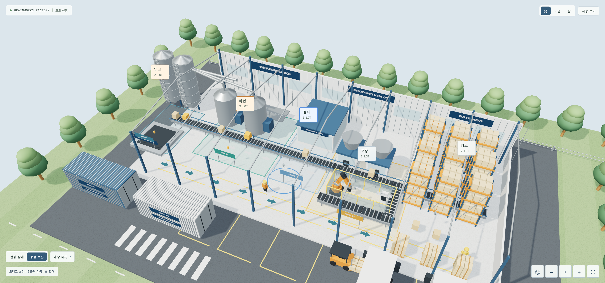
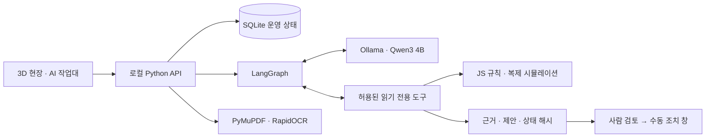

# Grainworks — 사료 생산·품질 데이터 통합 AI 업무 지원 시스템

**사료 생산공정과 품질 기록을 연결하고, 실제 로컬 AI가 근거와 가상 조건을 설명하는 제조 업무 프로토타입.**

주문·Lot·검사·원료·모의 트럭 배정을 연결한 3D 운영 화면에 실제 로컬 오픈소스 LLM Agent를 붙였습니다. 표와 화면을 오가며 연결 대상을 찾는 불편을 가정하고 만든 독립적인 개인 프로젝트입니다. 현장 인터뷰나 회사 내부 요구사항을 확인한 프로젝트는 아닙니다.



입고·배합·검사·포장 설비를 선택해 관련 Lot과 보류를 확인합니다. 설비 정지 비교는 화면의 시간 재생과 별도인 복사본 FIFO 용량 모델입니다. [구현 범위·직무 연결·검증 한계](docs/factory/README.md)에 두 모델과 실제 AI 기록을 구분했습니다.

## 실제 AI가 하는 일

| 작업 | 모델 역할 | 코드가 확인하는 내용 |
| --- | --- | --- |
| 주문 확인 | 주문 조회 도구 선택, Lot·경보에 근거한 상태 설명 | 부분 배정, 출하 완료·창고 준비·생산 대기·미출하 보류·미배정 및 기출하 영향 구분 |
| 공정 확인 | 설비 조회 도구 선택, 상태와 관련 Lot 설명 | 합성 처리 능력·대기 물량·품질 보류 기록 |
| 설비 정지 비교 | 명시한 설비·정지 시간·비교 시간으로 도구 선택 | 단일 설비 FIFO 복사 분기, 질량 보존·원본 불변·포장 완료 기준 |
| 출하 확인 | 경보·Lot·배정 조회 도구 선택, 근거 설명과 수동 조치 초안 | 저장된 상태의 ID·수량·기준값, 제안 대상 근거와 해제 전제 |
| 인수인계 | 실제 기록 조회 후 초안 작성 | 존재하는 활동 기록과 미확인 항목 구분 |
| 장부 대조 | 두 CSV의 컬럼 의미와 단위 연결 | kg/t 환산, 수량·검사값 차이, 중복·누락·모호한 단위 차단 |
| 문서 확인 | 원문에 있는 필드를 도구 인자로 제안 | PDF 문자 추출 / RapidOCR 이미지 인식, 부분문자열·숫자·위치 근거 |
| 조건 비교 | 명시적으로 입력한 가정으로 시뮬레이션 도구 선택 | JS 엔진 복제 분기, 물량 보존·원본 유지 |

Qwen 모델이 Ollama의 native `tool_calls`를 반환하면 LangGraph가 허용된 조회·계산 도구를 실행하고 결과를 모델에 돌려줍니다. 임의 SQL·셸·파일 수정·재고 변경 도구는 제공하지 않습니다. 작업별 도구 집합, 최대 6회 모델 호출·14회 도구 호출, 추론 동시 실행 1개로 범위를 제한합니다. 모델 오류나 미연결 때 규칙 요약을 AI 답변으로 대신하지 않습니다.

근거 카드와 수량 계산은 도구 결과입니다. 모델의 자유 서술과 컬럼 의미 매핑은 완전 검증됐다고 주장하지 않습니다. 미확인 식별자·숫자가 들어간 설명은 보류하며, `summaryVerified:false`를 화면에 표시합니다. 도구 실행 기록은 내부 사고 과정이 아닙니다.

## 공장 안에서 주문 관리

공장 화면의 오른쪽 패널에서 합성 주문 5개를 확인합니다. 주문을 선택하면 연결된 공정이 강조되고, Lot 상세와 트럭 출하 계획으로 이동할 수 있습니다. 작은 화면에서는 공장 바로 아래에 패널이 배치됩니다. 별도 주문 페이지를 열지 않습니다.

배정 수정은 사람이 수행합니다. 같은 제품의 미출하 Lot 수량과 트럭을 선택하며, 주문 사이의 배정 합계가 Lot 수량을 넘거나 요청 수량을 초과하면 전체 변경을 거절합니다. 이미 출하된 Lot의 배정은 편집할 수 없습니다. 배정은 재고 수량을 바꾸지 않으며 브라우저와 SQLite에 저장됩니다.

수분 이상 시 SO-001은 요청 13,000kg / 출하 이력 4,000kg / 현재 보류 배정 8,400kg / 미배정 600kg입니다. LOT-009의 기출하 품질 영향 4,000kg은 출하 이력의 부분 집합이며 현재 보류에 더하지 않습니다. 가상 납기와 포장 준비 상태만 계산하고 실제 배송 성공을 예측하지 않습니다. [주문 모델·조작·검증 범위](docs/orders/README.md)를 참고하세요.

## 포트폴리오와 실행 근거

- [3페이지 포트폴리오](docs/portfolio/portfolio.pdf) - v12: 큰 실제 화면의 영역 테두리와 연결 설명, 배정 전후·실제 LLM 구조와 오류 검증
- [주문 연결 실행·검수 기록](docs/orders/README.md)
- [새 설비 조회·정지 비교·품질 영향의 실제 모델 기록](docs/factory/README.md)
- [실제 모델 평가 기록](docs/evaluation/live-model.json) · [평가 설명](docs/evaluation/README.md)
- [문서 추출 검증과 한글 OCR 한계](DOCUMENT_INTAKE.md)

## 실행

Python 3.13, Node.js 22 이상, [Ollama](https://ollama.com)가 필요합니다. 모델 가중치는 별도 다운로드이며 저장소에 포함하지 않습니다.

```powershell
git clone https://github.com/Kimhyuntae9665/grainworks-agent.git
cd grainworks-agent
./setup.ps1
ollama pull qwen3:4b-instruct
./start.ps1
```

브라우저에서 `http://127.0.0.1:8795`를 엽니다. Ollama가 별도로 실행 중이어야 합니다. 모델 API는 `127.0.0.1:11434`로 고정했습니다. 모델 설치가 없으면 3D와 수동 조치는 사용할 수 있고 Agent는 미연결 상태로 표시됩니다.

Linux/macOS:

```sh
python3 -m venv .venv
.venv/bin/pip install -r requirements.txt
ollama pull qwen3:4b-instruct
.venv/bin/python server.py --port 8795 --db work/grainworks.sqlite3
```

문서 확인에 사용할 합성 PDF·이미지는 `fixtures/demo-check.pdf`, `fixtures/demo-check.png`에 있습니다. 데이터 대사 샘플은 화면에서 편집하거나 `fixtures/reconcile-*.csv`를 사용합니다. 모델 입력 자료는 로컬에서 처리하지만 Ollama 모델과 OCR 모델의 최초 설치에는 다운로드가 필요합니다.

## 같은 사건을 끝까지 추적하기

기본 공장 사건은 RAW-2401의 합성 수분15.8%가 **시연 기준14%**를 넘은 경우입니다. LOT-001과 LOT-003의 미출하8,400kg은 보류하고 LOT-009의 기출하4,000kg은 영향 확인으로 분리합니다. 생산 구역·창고·트럭은 같은 Lot 기록의 다른 보기이므로 중복 합산하지 않습니다. 기존 LOT-007 온도31°C/기준28°C 보류 사건은 `fixtures/demo-state.json`과 이전 평가 기록에 별도로 보존했습니다.

AI 초안의 ‘검토’를 누르면 최신 저장 상태의 해시와 제안의 단일 사용을 확인한 뒤 기존 수동 조치 창을 엽니다. 이는 재고를 바꾸는 승인이 아닙니다. 사람은 사유와 검사값을 입력하며, 기준 이내 재검사 이후에도 보류 해제를 별도로 수행합니다. 서버가 재시작되면 메모리의 Agent 실행·제안 기록은 사라지고 운영 상태는 SQLite에 남습니다. 실제 사용자 인증·조직 권한 체계를 구현한 시스템은 아닙니다.

새 설비 정지 비교는 MIX-01 10분 정지와 정상 조건을20분 비교하며 포장 완료15,200kg/10,000kg을 반환합니다. 60분 뒤에는 양쪽19,400kg로 같아집니다. 기존 재검사 조건 비교는 사용자가 선택한 보류 Lot의 수분·온도·시간을 입력해 모의 재검사와 별도 해제 완료를 가정하는 기능입니다. 두 모델의 결과를 혼합하지 않으며 실제 납기 최적화나 생산 효율 개선 실적이 아닙니다.

## 구조


**Python API ↔ LangGraph ↔ Ollama ↔ Qwen3 4B.** Ollama가 모델을 로컬 실행하고, LangGraph가 조회·계산 도구를 반복 호출합니다. [구조 설명·SVG·로고 출처](docs/portfolio/flow/README.md)는 포트폴리오 3쪽에 반영했습니다. 첫 장은 현장 화면을 크게 배치했습니다.




## 검증

```powershell
node --test engine.test.js assets.test.js factory_model.test.js
./.venv/Scripts/python.exe server.test.py
./.venv/Scripts/python.exe agent_backend.test.py
./.venv/Scripts/python.exe agent_api.test.py
./.venv/Scripts/python.exe document_intake.test.py
./.venv/Scripts/python.exe factory_tools.test.py
./.venv/Scripts/python.exe evaluate_agent.py
```

마지막 명령은 **실제 모델**을 호출합니다. 나머지의 모의 전송 테스트는 서버 흐름·가드 검증이며 모델 정확도 시험으로 합산하지 않습니다. CI는 합성 데이터의 엔진·도구·API·문서 추출 테스트를 수행합니다. 실제 모델 평가의 대상·성공·실패·지연은 평가 파일에 함께 남깁니다.

## 기여와 출처

김현태는 제조 업무 프로젝트 방향, Port Wright·Airsup 참고 화면, 그래픽과 현장 대상 상태 조회, 포트폴리오 개선, 실제 AI 확장을 요구하고 피드백했습니다. Codex가 이 요구를 바탕으로 코드·테스트·문서·공개 저장소를 구현했습니다. 개인이 모든 코드를 직접 작성했거나 모델을 학습한 경험으로 주장하지 않습니다.

[우성 공개 MES 소개](https://www.woosungfeed.co.kr/m11.php)의 원료 입고부터 제품 출고까지 이어지는 흐름에 착안했습니다. 실제 우성 ERP/MES·센서·고객 데이터·내부 SOP와 연동하지 않았습니다. 모든 제조·검사·배정 데이터와 절차 문서는 합성 또는 직접 작성한 모의 자료입니다.

공개 연락 경로: [Kimhyuntae9665](https://github.com/Kimhyuntae9665). 의존성·모델·시각 참고 출처와 사용 조건은 [THIRD_PARTY_NOTICES.md](THIRD_PARTY_NOTICES.md)에 구분했습니다.
