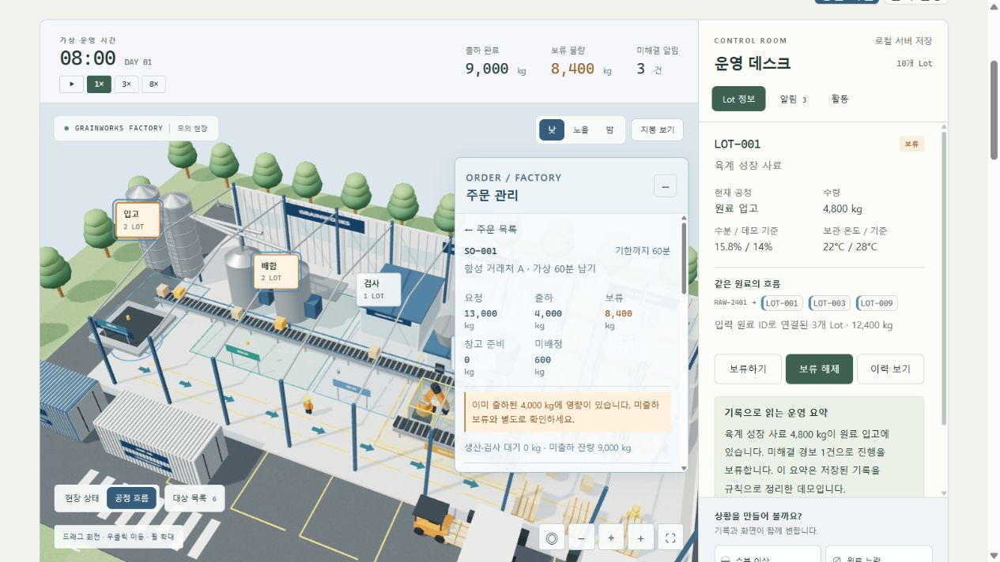

# 주문·생산·품질 연결

2026.10.07. 합성 고객 주문을 공장 화면에서 Lot·품질·출하 계획과 함께 확인하는 확장이다. 실제 고객 주문이나 ERP/MES를 연결한 결과가 아니다.

## 한 화면에서 하는 일

1. 오른쪽 주문 패널에서 SO-001 등 주문을 선택한다. 요청·출하·보류·창고 준비·미배정을 확인한다.
2. 연결된 공정의 강조 표시와 Lot 버튼으로 생산/검사 기록을 확인한다. 트럭 버튼은 같은 공장의 출하 계획을 연다.
3. 미출하 Lot의 배정 수량과 트럭을 수정하거나 0kg으로 배정을 해제한다. 재고량 자체는 변경하지 않는다.
4. 주문 패널의 AI 질문 버튼을 누르면 선택한 주문 ID가 질의에 포함된다. AI는 저장한 주문·배정·검사 근거를 읽으며 배정을 수정하지 않는다.
5. 설비 정지 비교에서는 원본의 복사본을 계산하여 주문별 창고 준비 물량을 비교한다. 기존 출하 이력은 유지한다.

주문 목록/상세는 접을 수 있다. 800px 이하에서는 공장 바로 아래에 배치되며 같은 화면의 일부로 유지된다. Lot/트럭 정보와 주문 패널이 겹칠 때 트럭 정보 확인 동안 주문 패널이 잠시 숨겨지고 닫으면 복원된다.

## 계산 규칙

- 주문 ID, 주문행 ID, 제품, 요청 kg, 가상 납기 분(dueTick), Lot별 부분 배정 kg와 트럭 ID를 저장한다.
- 각 Lot의 전체 주문 배정 합계는 재고 kg 이하, 각 주문행 배정 합계는 요청 kg 이하다. 동일 행의 중복 Lot, 중복 ID, 다른 제품, 없는 Lot/트럭, 비정상 숫자를 거절한다.
- `allocatedKg = shippedKg + readyKg + workInProgressKg + heldKg`이며 `requestedKg = allocatedKg + unallocatedKg`이다.
- `shippedImpactKg`은 이미 출하된 배정의 품질 영향 부분 집합이다. 출하·현재 보류·재고에 다시 더하지 않는다.
- 창고 준비는 미출하 창고 Lot 중 차단 경보·보류·누락/지연/기준 초과 품질 기록이 없는 배정이다. 저장 경보가 없지만 확인이 필요한 측정값은 그 사실을 구분해 표시한다. 검사 결과나 경보를 새로 만들어냈다고 쓰지 않는다.
- 트럭은 주문의 미출하 Lot 배정 계획을 보여준다. 실제 적재나 차량 위치·경로·운송 완료가 아니다. 창고/컨테이너는 같은 Lot 재고의 다른 보기이며 서로 합산하지 않는다.
- 가상 납기는 화면의 가상 시간과 비교한 표시다. 용량 비교도 가상 관측 시점과 포장 준비를 계산할 뿐 배송 완료나 현실의 납기 준수를 보장하지 않는다.

## 재현 시나리오

초기 주문은 5개, 요청 45,100kg / Lot 재고 및 전체 배정 44,500kg / 미배정 600kg이다. 요청 수량은 실제 재고량과 별개의 수요다.

수분 이상을 적용하면 SO-001의 LOT-001 4,800kg과 LOT-003 3,600kg이 현재 보류 배정 8,400kg이 된다. 이미 출하된 LOT-009 4,000kg은 기출하 영향으로 별도 표시한다. 요청 13,000kg에는 기존 출하 이력 4,000kg, 미배정 600kg이 포함된다. 15.8%/14%는 시연 기록/시연 기준이고 회사 실제 검사 기준이 아니다.

LOT-001 배정을 3,000kg으로 바꾸면 주문의 보류 배정은 6,600kg, 미배정은 2,400kg으로 바뀐다. 실제 Lot 재고는 4,800kg이고 공장 총재고는 44,500kg으로 유지된다. 같은 Lot에 5,000kg을 배정하려 하면 거절한다. 이는 주문에 배정된 물량의 변화이며 실제 품질 보류 해제가 아니다.

## AI와 검증

실제 Qwen3 4B / Ollama / LangGraph의 `get_order_status` native tool call로 공유 JS 모델을 조회한다. 주문·주문행·배정·Lot·측정/경보 근거를 제공하며, 명시한 주문을 다른 주문으로 대신 조회하지 못하게 제한한다. 없는 주문은 판단을 보류한다. AI에 배정 변경·출하·해제 도구는 없다.

첫 실제 응답은 도구 물량은 맞았으나 현재 보류 Lot 목록에 이미 출하된 LOT-009를 포함했다. 실패 기록을 보존하고 모델 입력에 `heldLotIds`와 `shippedImpactLotIds`, 배정별 단계와 물량을 분리했다. 재실행에서는 LOT-001/003 보류와 LOT-009 기출하 영향을 올바르게 구분했다. 해당 응답은 미배정 600kg을 자유 서술에서 생략했으므로 요청 범위 전체의 완전한 요약으로 평가하지 않는다. 원본의 수치·상태는 도구 카드로 확인한다. `summaryVerified:false`는 유지한다.

실제 화면의 주문 질문 버튼으로도 Qwen을 실행했다. 마지막 실행은 약 53초, 실제 모델 응답 2회·`get_order_status` 호출 1회였다. 요청 13,000kg, 배정 12,400kg, 미배정 600kg, 출하 4,000kg, 미출하 보류 8,400kg을 서술에서 확인했다. 현재 보류는 LOT-001/003, LOT-009는 기출하 영향으로 구분했다. 창고 준비 0kg과 가상 납기 상태는 서술에서 생략되어 도구 카드로 보여준다. 한 사례의 대조이며 일반적인 AI 정확도를 측정한 것은 아니다.

통합 검수에서 JS 46개·Python 72개 검사 항목을 통과했다. 수량/상품/재고 초과 배정 거절, 저장 복원, 기존 공장 및 AI 도구 회귀 검사를 포함한다. [수량·경계·회귀 검사](deterministic-qa.json), [실제 모델 재실행](live-order.json), [실제 화면 모델 실행](live-ui-order.json), [첫 서술 실패](history/order-attribution-failure.json), [화면·조작 검수](ui-qa.json)에 결과를 남겼다. 자동 검사 통과와 AI 자유 서술의 정확도는 별개의 검증이다.

## 실제 화면

공장 오른쪽 주문 패널과 선택 Lot의 품질 근거를 한 화면에 표시한다.

[부분 배정 변경 화면](order-partial.png) · [390px 화면](order-mobile.png) · [실제 AI 응답 화면](order-ai.png)

## 실행

프로젝트 루트에서 `setup.ps1`, `start.ps1`을 실행한다. Ollama의 `qwen3:4b-instruct`가 준비되어 있어야 실제 AI를 실행한다. 모델 미연결 시 주문과 공장 계산은 사용할 수 있고 AI는 연결 오류를 표시한다.

현재는 고정 합성 주문과 수동 배정 편집을 다룬다. 고객 주문 생성/취소, 구매 주문, SKU 마스터, 실제 ERP/MES, 조직 인증·권한·현장 운영은 범위에 포함되지 않는다.
