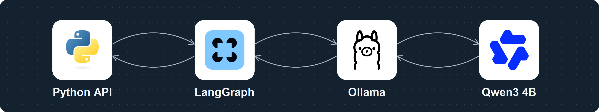

# 로컬 AI 실행 구조



Python API는 질문과 저장 상태를 LangGraph에 전달합니다. LangGraph는 Ollama의 `/api/chat`을 호출하고 모델이 선택한 허용된 읽기 전용 도구를 실행합니다. 도구 결과를 모델에 돌려준 뒤 근거와 초안을 UI에 반환합니다. 사람은 수동 조치 창에서 사유와 검사값을 확인하고 조치를 결정합니다.

**Ollama가 로컬 Qwen3 4B 모델을 실행합니다.** Qwen3는 별도의 네트워크 서버가 아닙니다. 연결선의 위쪽 화살표는 요청/실행, 아래쪽은 응답/결과 반환입니다. 이 그림은 주요 호출 관계를 요약하며 도구 반복 루프와 SQLite의 모든 연결을 그린 전체 시스템 도면은 아닙니다. 가상 데이터의 로컬 프로토타입이며 회사 배포·연동을 의미하지 않습니다.

- 실제 모델 태그: `qwen3:4b-instruct`, Ollama CPU 실행
- [편집 가능한 SVG](architecture-flow.svg) · [그래프 데이터](graph.json)
- [공식 로고 출처·SHA-256·사용 조건](assets-manifest.json)
- [3페이지 포트폴리오](../portfolio.pdf) 첫 장에 삽입

각 흰 카드에는 공식 독립 심볼만 배치하고 이름은 카드 아래에 표시했습니다. Qwen3 4B에는 QwenLM 공식 패밀리 심볼을 사용했습니다. 로고는 기술 식별 목적이며 해당 브랜드의 후원이나 회사 협업을 의미하지 않습니다. 원본 SVG/PNG는 `logos/`에 보존했습니다.

## 다시 렌더링

이미 설치된 Python 및 CairoSVG를 사용합니다. 스크립트는 네트워크 다운로드를 수행하지 않습니다.

```sh
python render_flow.py
```

`architecture-flow.svg`와 3200×600 PNG, graph/manifest를 생성합니다. SVG에는 title/desc와 로고가 포함되어 있습니다. 새 설명 캡션은 i-am-not-ai light 검수, 변경률 0.0%, 복원·게이트 PASS로 원문 유지했습니다.
