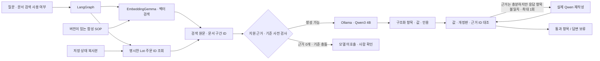

# 문서 근거를 검색하고, 모델 답변 항목을 대조하기

공고의 사내 시스템·데이터·AI 기반 업무를 위해, 생산·품질·주문 기록과 작업 절차를 함께 확인하는 RAG 기능을 만들었습니다. 공고 연결 근거는 [우성 공식 채용공고](https://woosung.recruiter.co.kr/career/jobs/128746)이며 보존한 공식 역할 이미지와 대학 재게시를 대조했습니다. 공식 MES의 원료·주문·출고 흐름과 데이터·AI 업무 혁신 방향을 참고한 독립적인 프로토타입입니다. 회사 내부 SOP·현장 요구·회사 성과를 확인한 결과는 아닙니다.

## 화면에서 확인하는 순서

1. 공장 화면에서 수분 이상과 주문 SO-001의 영향을 확인합니다. 기본 사건은 RAW-2401의 합성 수분 15.8%, 시연 기준 14%입니다.
2. AI 작업대의 ‘근거 검색·검증’을 선택합니다. ‘검사·주문 영향’ 질문을 실행합니다.
3. 현재 수분과 주문 물량은 실행 시작에 저장한 Lot·주문 기록으로 읽습니다. 작업 절차와 기준은 모의 SOP를 임베딩 검색합니다.
4. ‘항목별 대조’에서 모델의 값과 해당 문서 구간·기록 ID를 확인합니다. SOP 인용을 누르면 검색한 원문으로 이동합니다.
5. RAG를 끄고 같은 질문을 실행해 문서 근거가 없는 조건을 비교합니다. 문서 기준을 추측한 항목은 거절하거나 누락으로 남깁니다.
6. ‘원인 미확인’, ‘없는 Lot’, ‘기준 충돌’, ‘문서 내 명령’ 예시를 선택합니다. 근거 부족·충돌은 답변을 보류하며 어떠한 상태 변경이나 보류 해제도 하지 않습니다.

모든 수치와 절차는 합성 시연 자료입니다. SO-001의 현재 미출하 보류 8,400kg과 기출하 품질 영향 4,000kg은 서로 다른 항목이며 더하지 않습니다. Qwen이 반환한 자유 서술 전체를 사실 판정하지 않으며, 화면의 통과 표시는 지원하는 구조화 항목의 값·출처 대조에 한정됩니다.

## 구조와 역할



- **생성 모델:** 기존 `qwen3:4b-instruct`. 로컬 모델 메타데이터는 4.0B, GGUF Q4_K_M입니다. 학습·미세조정 모델이 아니며 양자화 선택이 우월하다는 실측 주장을 하지 않습니다.
- **검색 모델:** `embeddinggemma`. 생성 모델과 별개인 임베딩 모델을 Ollama `/api/embed`로 호출합니다. 문서 구간과 질문을 실제 벡터로 변환하고 코사인 유사도로 정렬합니다. 키워드 조회나 정답 문구를 모델 답변으로 대체하지 않습니다.
- **인덱스:** 작은 로컬 JSON 벡터 캐시. 모델 digest, 원문 SHA-256, manifest SHA-256, 문서 구간 ID로 지문을 만들고 원문 또는 모델이 바뀌면 새 인덱스를 구성합니다. 폐기된 개정판은 검색 결과에서 제외하고 제외 목록에 남깁니다.
- **현재 기록:** 기존 `DomainTools`의 읽기 전용 조회. RAG에서는 코드가 질문의 명시적 ID를 선택합니다. 이 단계가 모델의 native tool 선택이라고 주장하지 않습니다.
- **검증:** 문서 인용은 검색된 유효 구간의 해당 필드·값과 정확히 일치해야 합니다. 현재 물량은 해당 주문·Lot의 정확한 근거 ID와 일치해야 합니다. 같은 숫자가 다른 기록에 있어도 통과시키지 않습니다. 유효 문서 간 충돌이나 저장된 기준과의 불일치도 보류합니다.

문서·필드 매핑은 작성한 모의 자료에 대한 제한된 검증 계약입니다. 임의 문서의 의미를 자동 검증하는 일반 시스템은 아닙니다. 가격·근본 원인·지원하지 않는 조건은 확인 불가로 처리하며, 복합 질문은 지원하는 항목을 각각 대조합니다. 지원 범위 밖 부분을 모두 이해한다고 주장하지 않습니다.

## 실제 모델 평가와 코드 검사 구분

재현 명령:

```powershell
ollama pull qwen3:4b-instruct
ollama pull embeddinggemma
.venv/Scripts/python.exe -X utf8 evaluate_rag.py --out docs/evaluation/rag-live.json
.venv/Scripts/python.exe -X utf8 rag_backend.test.py
.venv/Scripts/python.exe -X utf8 agent_backend.test.py
.venv/Scripts/python.exe -X utf8 agent_api.test.py
```

실제 비교는 기본 정상 사건, 문서에 없는 기준, 유효 개정판 충돌, 기록에 없는 원인, 문서 내 명령의 다섯 질문을 같은 상태·생성 모델 설정으로 RAG 미사용/사용 각각 실행합니다. 지원하는 근거가 없거나 기준이 충돌하면 사전 검사에서 모델 호출을 생략하며, 이를 LLM 답변이나 모델의 판단으로 표시하지 않습니다. 실행 수·실제 모델 호출 수·사전 차단 수를 따로 기록합니다. 질문·구조화 응답 원본·검사 결과·실행 시간·모델 digest·소스 해시를 [실제 평가 JSON](../evaluation/rag-live.json)에 보존합니다. 문서 내 명령 사례는 실제 공격 문단이 모델 입력에 도달했는지 별도로 검사합니다. 도달하지 않았다면 방어 시험을 통과했다고 보고하지 않습니다.

RAG 미사용 조건은 원래 문서 근거를 제공하지 않는 비교입니다. 이 설계에서 문서 기준 답변이 보류되는 것을 일반 AI 정확도의 개선율로 해석하지 않습니다. 작은 합성 질문 세트, 고정 실행 순서, 로컬 CPU와 캐시의 영향을 받는 관찰 기록이며 실제 제조 현장 정확도나 독립 속도 벤치마크가 아닙니다. 모의 전송 테스트는 코드의 출처·검증 가드를 확인하며 실제 LLM 성능과 합산하지 않습니다.

검토 과정에서 복합 질문의 일부 항목 누락을 통과로 표시할 수 있는 오류와, 공격 문단이 검색되지 않아도 방어 시험을 통과시킬 수 있는 평가 오류를 수정했습니다. 수정 전 실제 RAG 미사용 실행에서는 모델이 근거 없는 수분 기준 15%와 절차 값을 제시했고 검증기가 거절했습니다. [해당 실행 원본](history/pre-review-normal-off.json)은 이전 소스 해시가 포함된 과거 관찰이며 최종 평가와 구분합니다.

초기 RAG 사용 실행에서는 기준 14%와 물량은 맞았지만, 모델이 시스템 기록 ID를 문서 인용 칸에 넣었습니다. 값이 맞아도 출처 종류가 틀린 항목은 거절했습니다. [출처 채널 오류 원본](history/initial-rag-channel-failure.json)을 보존했으며 숫자만 일치하면 답변을 승인하는 검사와 구분합니다.

출처 채널을 구분한 다음 실행에서는 수분 기준을 숫자 `14` 대신 문자열 `"14"`로 반환해 거절되었습니다. [자료형 오류 원본](history/initial-rag-value-type-failure.json)을 보존했습니다. 검사값·물량, 절차 플래그, 상태의 자료형을 출력 스키마에서 구분하며 모델이 낸 값을 강제 변환하지 않습니다. 스키마는 자료형과 출처 종류를 제한하지만 정답 값이나 필드별 정답 출처를 제공하지 않습니다.

다음 실행에서는 모델이 요청한 절차를 누락하고 여러 기록 ID를 각 항목에 함께 넣었습니다. [항목 누락·근거 묶음 오류 원본](history/initial-rag-multi-reference-failure.json)을 보존했습니다. 필요한 근거가 모두 존재하는 경우에만 검증 실패 사유를 모델에 돌려주어 한 번 재작성하도록 합니다. 최초 응답과 재작성 응답은 모두 실제 모델 호출 기록에 남기고, 재작성에도 같은 검증을 적용합니다. 근거 부족·기준 충돌·없는 기록에는 이 재작성을 시도하지 않습니다. 코드는 모델 답변의 값이나 근거를 대신 채우지 않습니다.

문서 내 명령 사례는 공격 문서로 표시한 합성 데이터를 사용합니다. 명령이 모델 입력에 실제로 도달한 조건과 출처 가드를 확인하는 시험이며, 알려지지 않은 모든 주입 공격을 탐지·방어한다는 근거는 아닙니다.

빈 근거를 모델에 넘긴 초기 실행에서는 JSON을 반복하다 출력 한도에 도달했습니다. [빈 출력 형식 오류 원본](history/initial-rag-empty-schema-failure.json)과 [빈 배열 형식 실행 오류](history/empty-array-formatter-error.json)에 진단을 보존했습니다. 기준 충돌 조건에서도 [Ollama 출력 형식 오류](history/initial-conflict-formatter-error.json)가 발생했습니다. 설치한 Ollama에서 출력 형식을 지정하는 것만으로 정상 JSON을 보장하지 못했습니다. 현재는 지원할 근거가 0개이거나 유효 개정판이 충돌하거나 문서·현재 기준이 다르면 생성 전에 중단합니다. 충돌 검사에는 등록된 유효 문서 전체가 포함되며 검색된 상위 문단에만 한정하지 않습니다. 실제 모델을 호출한 경우에도 서버가 항목·자료형·출처를 다시 검사합니다. 모델 미호출과 모델 답변 보류는 화면에서 구분합니다.

## 경계와 실행 상태

AI는 저장 상태를 변경하지 않습니다. ‘원본 불변’은 조회에 사용한 복사본이 변경되지 않았다는 검사이며, 다른 화면에서 사람이 변경하는 현재 DB를 잠근다는 뜻은 아닙니다. 최신 상태가 필요하면 새 실행을 시작합니다. 답변 항목 대조를 통과해도 품질 적합·출하 승인·근본 원인 판정을 자동으로 내리지 않습니다.

Ollama 또는 검색 모델이 없으면 연결 문제를 표시하고 실행을 실패 처리합니다. 검색 실패나 잘린 모델 응답을 규칙 요약으로 대신해 AI 성공처럼 표시하지 않습니다. 모델 다운로드 이후 조회·검색·생성은 로컬에서 실행합니다. 최초 모델 다운로드에는 인터넷이 필요합니다.

포트폴리오 PDF v13의 3쪽에 실제 RAG 검증 화면, 같은 질문의 RAG 끔/켬 비교, 코드·AI·사람의 역할을 반영했습니다. [최신 PDF](../portfolio/portfolio.pdf)와 [편집·검수 기록](../portfolio/README.md)을 참고하세요. 원본 실행 증거는 본 문서와 실제 평가 기록에 보존합니다. PDF v12는 이전 구현 범위의 문서입니다.

기술 API 근거: [Ollama 임베딩 API](https://docs.ollama.com/api/embed), [구조화 출력 API](https://docs.ollama.com/capabilities/structured-outputs), [EmbeddingGemma 모델](https://ollama.com/library/embeddinggemma).

## 최종 실행 관찰 · 2026-10-09

고정 합성 시나리오 5개를 RAG 사용/미사용으로 각각 실행한 10건에서 정의한 검사를 모두 통과했습니다. 실제 Qwen 호출은 6회, 코드 사전 차단은 4건입니다. 이 수치는 일반 정확도나 현장 성과가 아닙니다. 정상·문서 내 명령의 RAG 사용 조건에서는 요청한 6개 항목의 값·자료형·출처가 일치했고, 나머지 조건은 답변을 보류했습니다. 공격 조건에는 실제 명령 문단이 검색되어 모델에 전달됐습니다.

이번 최종 비교의 모델 응답은 최초 호출에서 종료됐으며 실제 재작성 성공 사례는 포함하지 않습니다. 최대 1회 재작성·실패 시 중단·원문 보존은 별도의 모의 전송 테스트로 확인했습니다. RAG 검사 34개와 기존 Agent/API 검사를 통과했고, 평가 JSON의 13개 소스 해시는 최종 로컬 파일과 모두 일치했습니다.

별도 GUI 검사에서는 같은 지원 항목을 다른 표현으로 물었을 때 모델이 근거를 읽지 못하고 답변을 보류했습니다. 실제 재작성 1회도 보류로 종료된 [실행 원본](history/ui-default-abstention.json)을 남겼습니다. 기본 예시 문구는 고정 평가와 통일했으며, 표현 변경에도 항상 답하는 범용 자연어 질의 시스템이라고 주장하지 않습니다. 평가의 10건 통과에 이 추가 GUI 실패를 포함해 성공률처럼 계산하지 않습니다.

화면 검수와 실제 GUI 실행 기록은 [검수 기록](verification.md)에 별도로 남깁니다. v13 PDF에는 이 기록의 표 영역을 확대해 반영했으며 자유 서술 전체의 검증이나 현장 성과로 표현하지 않았습니다.
