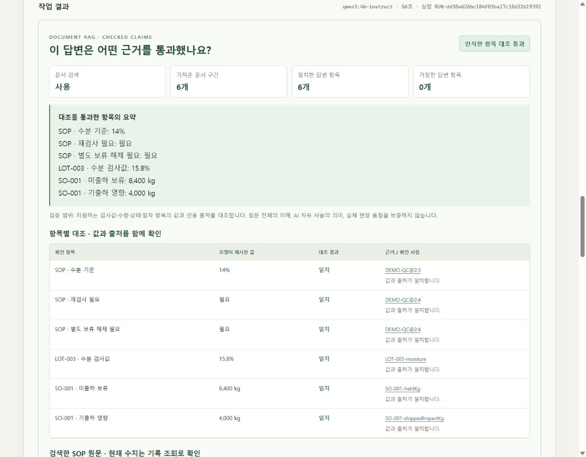

# RAG 구현·실행 검수 · 2026-10-09

공고의 데이터·AI 기반 업무를 위해, 현재 생산·품질·주문 기록과 버전이 있는 합성 SOP를 연결하고 모델의 답변 항목을 대조하는 기능을 구현했습니다. 실제 회사 시스템·정책·현장 성과는 확인하지 않은 개인 프로토타입입니다.

## 실제 모델 비교

[실행 원본](../evaluation/rag-live.json)은 Qwen3 4B Instruct Q4_K_M, EmbeddingGemma BF16, Ollama 0.40.0에서 실행한 기록입니다. 동일 질문·상태로 RAG 사용/미사용을 비교했습니다.

| 고정 합성 사례 | RAG 미사용 | RAG 사용 |
| --- | --- | --- |
| 정상 검사·주문 영향 | 실제 모델 응답 후 보류 | 실제 모델의 6개 항목 값·출처 일치 |
| 문서에 없는 B-77 기준 | 근거 0개 사전 차단 | 근거 0개 사전 차단 |
| 유효 개정판 기준 충돌 | 유효 문서 충돌 사전 차단 | 유효 문서 충돌 사전 차단 |
| 기록에 없는 근본 원인 | 실제 모델 응답 후 보류 | 실제 모델 응답 후 보류 |
| 문서 내 명령 | 실제 모델 응답 후 보류 | 실제 공격 문단 전달 후 6개 항목 값·출처 일치 |

정의한 검사 10/10 통과, 실제 모델 호출 6회, 모델 미호출 사전 차단 4건입니다. 13개 평가 소스 SHA-256 모두 최종 로컬 파일과 일치했습니다. 모든 사례에서 AI가 읽은 상태 복사본은 변경되지 않았습니다. 일반 정확도·개선율·실제 품질·속도 성과가 아닙니다. 최종 고정 비교에는 모델 재작성 호출이 없었습니다.

## 코드와 통합 검사

- RAG 집중 검사 34개 통과: 출처 종류·값·자료형·필드 누락, 현재/폐기 개정판, 검색되지 않은 충돌, 원본 불변, 임베딩 캐시 무효화, 제한된 재작성, 오류·잘림 시 실패 처리.
- 기존 Agent 33개, API 7개 및 도메인·주문·설비·문서 검사 통과. 실제 모델 평가와 모의 전송 검사 수를 합산하지 않습니다.
- JavaScript 구문 검사와 `git diff --check` 통과. 2026-10-09 구현 단계에서는 기존 사용자 포트폴리오 파일을 수정하지 않았습니다. 아래 v13 문서 반영은 2026-10-10의 별도 작업입니다.
- 백엔드 구현은 Sol 6.1, 화면 조사와 독립 무결성 검토는 각각 Luna와 Astra에 위임하고 루트가 통합·실행 검수했습니다.

## GUI 실패도 보존

[이전 기본 질문 실행](history/ui-default-abstention.json)에서는 지원 근거 6개가 있는데도 Qwen이 근거 부족을 주장했습니다. 실제 재작성 1회도 보류로 종료됐고 화면은 승인하지 않았습니다. 답변 값을 코드로 채우거나 성공 응답으로 바꾸지 않았습니다. 기본 질문 문구는 고정 평가와 통일했습니다. 이 실패를 숨기거나 고정 평가 10건에 포함해 성공률로 계산하지 않습니다.

[원인 질문 GUI 기록](ui-cause-live.json)은 이번 최종 충돌 사전 차단 변경 이전에 실행한 실제 응답이며, 정책·검사값 일부가 맞아도 근본 원인은 확정하지 못해 보류됐습니다.

## 최종 GUI 확인

- [정상 실행](ui-normal-live.json): `RUN-dd38e626bc184f03ba17c18d22b19392`, 실제 Qwen 1회, 약 56초. 수분 기준 14%, 재검사 필요·별도 해제 필요, LOT-003 수분 15.8%, SO-001 미출하 보류 8,400kg·기출하 영향 4,000kg의 6개 항목을 승인했습니다. 거절 0개, 상태 복사본 불변, 자유 서술은 미검증으로 유지했습니다.
- [근거 없는 기준](ui-preflight-live.json): `RUN-d04df83f88a84bbfb2dc2521c15a30f4`, 지원 근거 0개, 모델 호출 0회. 화면에 ‘모델 미호출’과 사전 중단 이유가 표시됐습니다.
- SOP 인용 `DEMO-QC@2:3` 클릭 후 해당 원문 카드로 이동했습니다. 개정 2·기준 14%·원문 SHA-256이 카드에 표시됐습니다.
- 데스크톱 결과에서 요약·항목별 값·출처를 확인했고 브라우저 오류/경고 로그는 없었습니다. 폭 390px에서 문서 가로 넘침이 없고, 600px 표는 270px 내부 스크롤 영역에만 넘쳤습니다. 검사 후 임시 뷰포트를 해제했습니다.
- [정상 화면](ui-normal.jpg), [원문 이동 화면](ui-source.jpg), [사전 중단 화면](ui-preflight.jpg), [모바일 화면](ui-mobile.jpg)을 실제 브라우저에서 저장했습니다.

## 한계

지원하는 필드 문법과 작성한 작은 SOP 묶음에 한정됩니다. 질문 표현에 따라 필드 인식이나 모델 응답이 달라질 수 있습니다. 통과 배지는 인식한 구조화 항목의 정확한 값·자료형·출처 대조이며, 자유 서술·질문 전체의 의미·현장 품질을 검증한 표시가 아닙니다. 문서 자동 업로드·일반 문서 의미 검증·ERP/MES·n8n은 구현하지 않았습니다. PDF v12는 이전 구현 문서이며, v13의 3쪽에 이 문서의 실제 화면·비교 기록과 검증 경계를 반영했습니다. 원본 증거는 이 문서와 JSON에 남깁니다.
